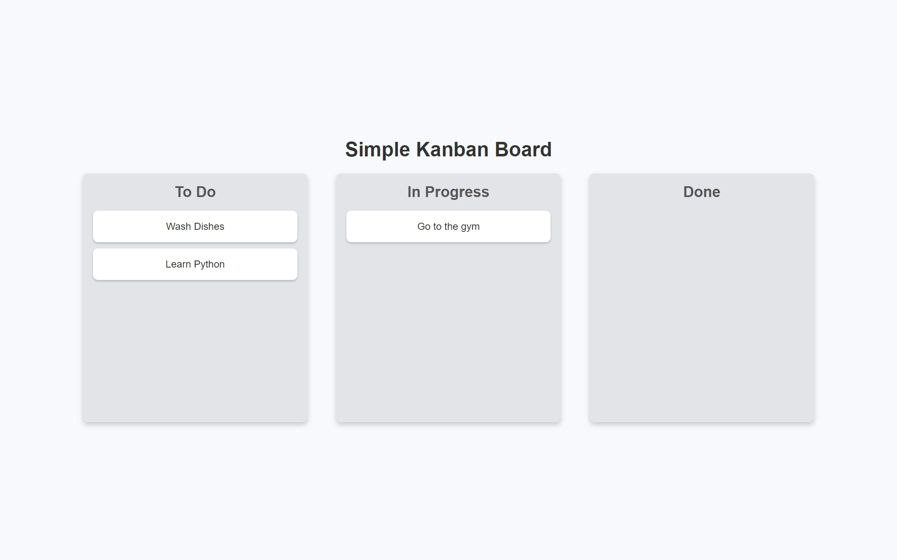
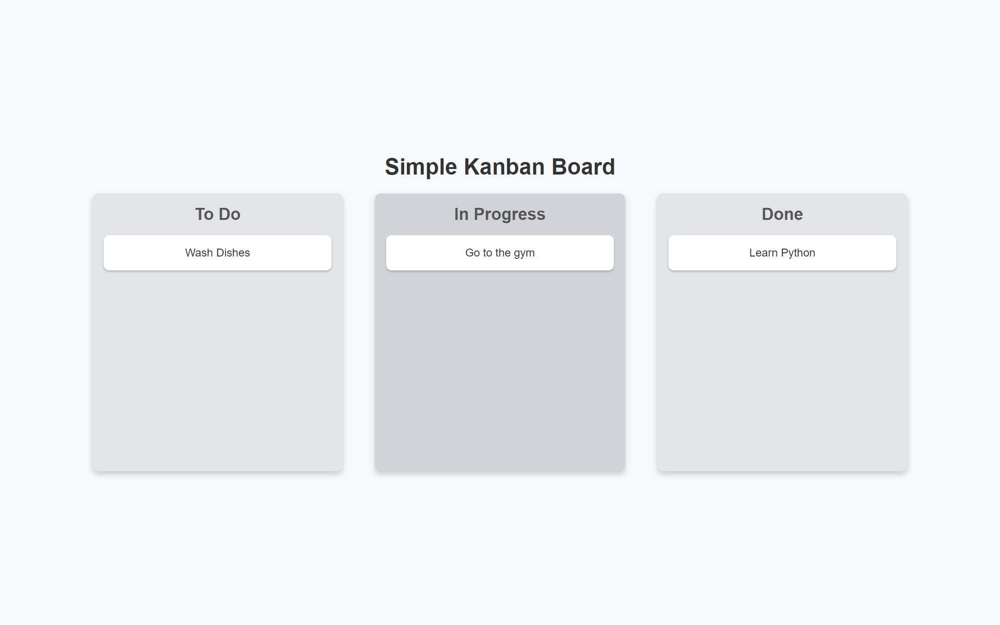

# Simple Kanban Board

A minimal and responsive Kanban board built with plain HTML, CSS, and JavaScript. It allows users to drag and drop task cards between different lists ("To Do", "In Progress", "Done").

## Features

- Drag and drop cards between lists using native HTML5 Drag and Drop API
- Responsive design that works well on both desktop and mobile devices
- Clean and simple user interface with smooth drag interactions

  
## 📸 Preview

## Link
https://resonant-cheesecake-d14c9b.netlify.app/

